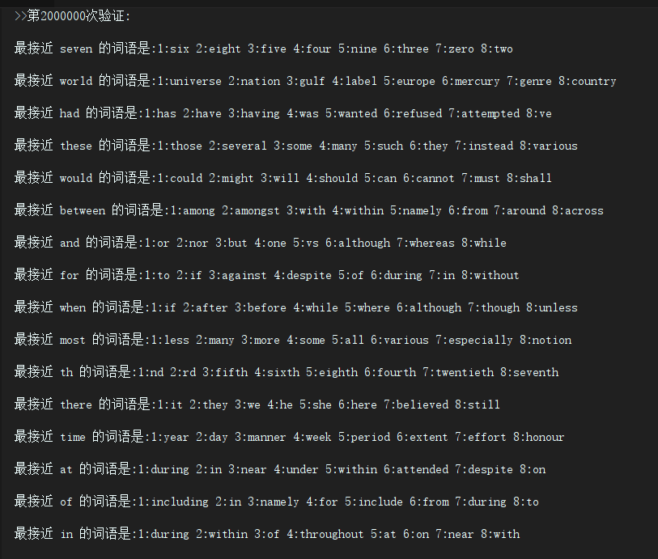
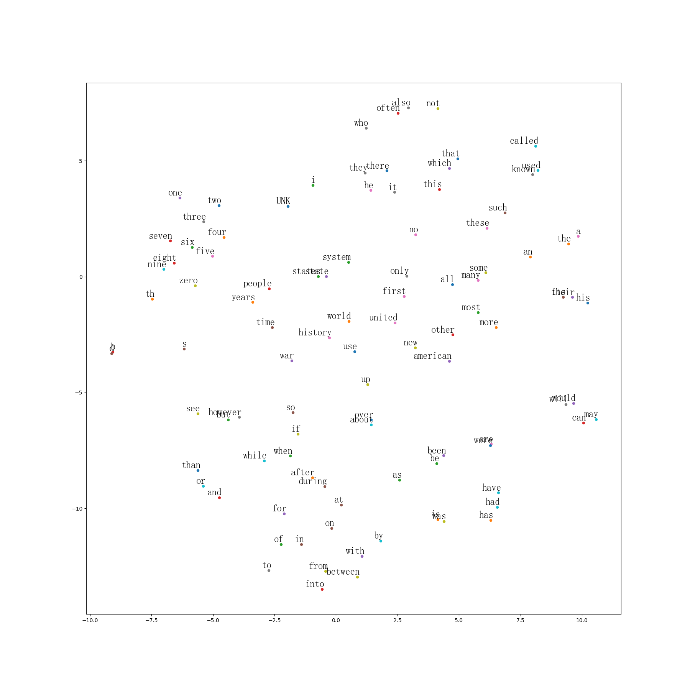
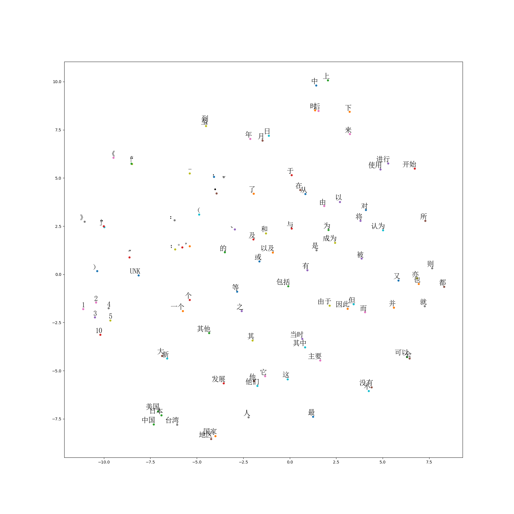
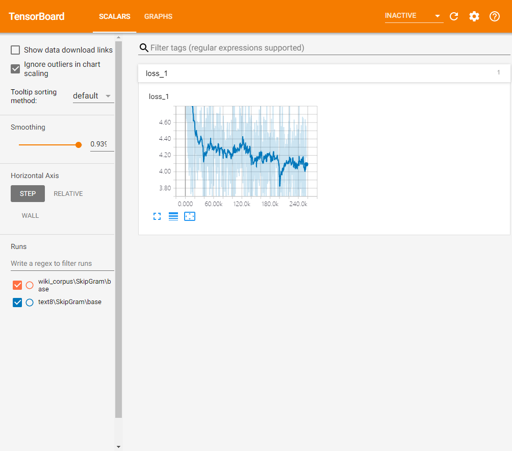

# word2vec
## 1.介绍
### 1.1 含义
NLP里最细粒度的是词语，所以处理 NLP 的问题，首先就要拿词语开刀。

但是NLP里的词语是人脸的抽象总结，是符号形式的(比如中文，英文，日语等)，所以为了能够让机器学习，我们就需要把他们转换成数值形式，或者说——嵌入到数学空间里。这种嵌入方式就叫词嵌入（word embedding)，而 Word2vec就是词嵌入（word embedding) 的一种。

大部分的有监督机器学习模型，都可以归结为 f(x) -> y

在 NLP 中，把 x 看做一个句子里的一个词语，y 是这个词语的上下文词语，那么这里的 f，便是 NLP 中经常出现的『语言模型』（language model），这个模型的目的，就是判断 (x,y) 这个样本，是否符合自然语言的法则，更通俗点说就是：词语x和词语y放在一起，是不是人话。

Word2vec 正是来源于这个思想，但它的最终目的，不是要把 f 训练得多么完美，而是只关心模型训练完后的副产物——模型参数（这里特指神经网络的权重），并将这些参数，作为输入 x 的某种向量化的表示，这个向量便叫做——词向量
我们举个例子(借鉴别人一个很有用的例子)，用Word2vec寻找相似词:
1. 对于一句话：[她们夸吴彦祖帅到没朋友]，如果输入x是[吴彦祖]，那么y可以是[她们]，[夸]，[帅]，[到]，[没朋友]这些词。
2. 现有另一句话：[她们夸我帅到没朋友]，如果输入x是[我]，不难发现，这里的上下文y跟上面一句话一样
3. 从而f(吴彦祖)=f(我)=y,所以大数据告诉我们：我=吴彦祖 (完美的结论)
### 1.2 模型介绍
上面说到， y 是 x 的上下文，所以 y 只取上下文里一个词语的时候，语言模型就变成：
> 用当前词 x 预测它的下一个词 y


## 2.训练过程介绍
### 2.1 环境安装
 ```yaml
 # environment.yaml
Python Environment: 3.6
tensorflow: 1.12
jieba
matplotlib
numpy
pathlib
pyyaml
scikit-learn
```
### 2.2 项目框架
 ```angular2
base_path
|
---_checkpoint # 存放训练生成的文件
|      |    data_name
|               |     model_name
|                        |    tag
|                              |   train # 存放训练的模型
|                              |   final_embeddings.yaml # 训练出来的结果
|                              |   tsne.png # 可视化后的结果
|      |    ...
--- configs # 训练的参数文档
|     |    ...
--- data # 原始的训练集
|     |    data_name.txt
|     |    ...
--- dataset # 处理过后的训练集
|     |    data_name
|              |    data.yaml # 机器要学习的文本
|              |    dictionary.tsv # 字典
|              |    info.yaml
|              |    reverse_dictionary.yaml # 反向字典
|     |    ...
--- scripts # 脚本
|     |    build_dataset.py # 将原始的数据 data ，处理后生成 dataset
|     |    ...
--- utils # 工具函数
|     |    ...
--- .gitignore # 忽视的内容
|
--- data_loader.py # 数据生成器
|
--- model.py  # 模型
|
--- test.py # 测试类
|
--- train.py # 训练类
|
--- environment.yaml # 环境包
```
### 2.3 训练过程
本项目把训练的过程拆分开来，主要是没办法一次性训练完。拆开保存中间结果可以更好的复现和调试代码。
#### 2.3.1 创建数据集
```bash
python scripts/build_ch_dataset.py
```
利用原数据data/data_name.txt，预处理，并把预处理后的结果保存到dataset/data_name里面
#### 2.3.2 训练网络
```bash
python train.py
```
利用处理好的数据集dataset,去训练网络，并保存训练后的网络模型和最后的词向量(final_embeddings.yaml)到_checkpoint/data_name/model_name/tag里面
#### 2.3.3 可视化结果
```bash
python test.py
```
利用训练好最后的词向量(final_embeddings.yaml)去生成可视化的结果，并保存到_checkpoint/data_name/mode_name/tag/tsne.png
#### 2.3.4 可视化训练过程
```bash
tensorboard --logdir=../tensorboard_logs
```
然后打开浏览器[https://localhost:6006](https://localhost:6006)
## 3.训练结果
### 3.1 训练时验证的结果

### 3.2 训练后可视化的结果
#### 3.2.1 英文的训练结果

#### 3.2.2 中文的训练结果

### 3.3 tensorflow 可视化的结果

## 4.参考
1. [理论:秒懂词向量Word2vec的本质](https://zhuanlan.zhihu.com/p/26306795)
2. [代码:tensorflow word2vec](https://github.com/tensorflow/tensorflow/blob/master/tensorflow/examples/tutorials/word2vec/word2vec_basic.py)
3. [代码:tensorflow word2vec demo详解](https://blog.csdn.net/weixin_42001089/article/details/81224869)
4. [代码:使用tensorflow实现word2vec中文词向量的训练](https://zhuanlan.zhihu.com/p/28979653)
